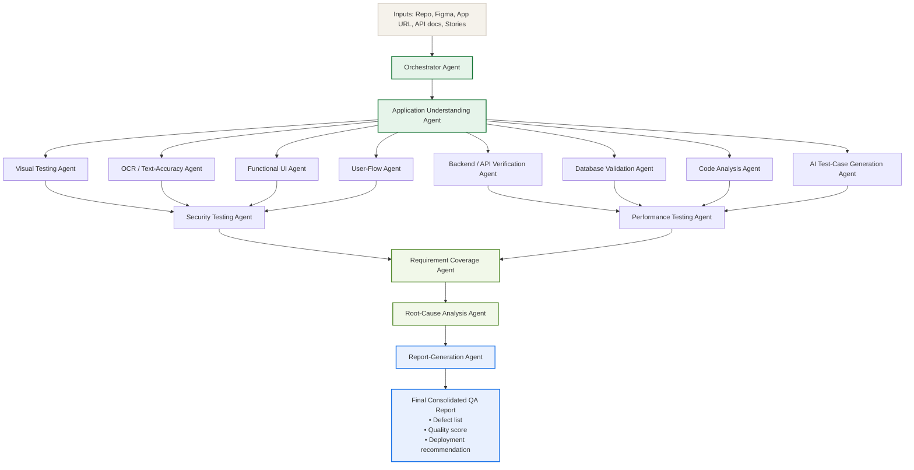

# SS TestSphere: Multi-Agent QA Orchestration Platform

This document serves as the technical specification and architectural blueprint for **SS TestSphere**, an autonomous, multi-agent QA orchestration platform. The system is designed to ingest a variety of inputs (repositories, design mockups, live URLs, API documentation, and user stories) and execute end-to-end parallelized validation workflows across frontend, backend, database, security, and performance layers.

---

## 1. System Architecture Workflow

The following Mermaid diagram outlines the operational pipeline of SS TestSphere, from initial inputs to the final consolidated QA report:

---

## 2. Agent Reference Catalog

The platform coordinates **1 Orchestrator Agent** and **14 specialized downstream agents** to perform targeted validations:

### Entry & Core Context Agents
*   **Orchestrator Agent (Entry Point)**
    *   **Description:** Processes all provided inputs (repository URL, Figma designs, live application URLs, API documentation, test cases, etc.).
    *   **Responsibility:** Decides which downstream agents are relevant, establishes their execution sequence, and merges their outputs into the final report.
*   **1. Application Understanding Agent**
    *   **Description:** Crawls the repository or live application.
    *   **Responsibility:** Identifies the frontend/backend frameworks, database engines, authentication methods, API surface, and overall architecture. Produces a shared **Context Object** that all other downstream agents read from.

### Parallel Testing Agents
*   **2. Visual Testing Agent**
    *   **Description:** Performs visual regression and design-to-implementation validation.
    *   **Responsibility:** Compares live UI screenshots against Figma mockups (pixel-diff + vision comparison). Outputs a similarity score and detailed mismatch list.
*   **3. OCR / Text-Accuracy Agent**
    *   **Description:** Validates text content displayed in the UI.
    *   **Responsibility:** Extracts all visible text from screenshots to check for spelling errors, capitalization issues, text truncation, incorrect localization/languages, or missing labels.
*   **4. Functional UI Agent**
    *   **Description:** Drives interactive browser automation.
    *   **Responsibility:** Detects interactive elements (buttons, dropdowns, tabs, inputs) and interacts with them via browser automation (e.g., Playwright). Monitors click behavior, loading indicators, disabled states, and error states.
*   **5. User-Flow Agent**
    *   **Description:** Validates end-to-end user journeys.
    *   **Responsibility:** Executes complete workflows (e.g., login, search, checkout) by chaining functional UI actions. Validates transitions, UI updates, redirects, and session persistence.
*   **6. Backend/API Verification Agent**
    *   **Description:** Inspects application networking and service APIs.
    *   **Responsibility:** Intercepts or replays API calls triggered by frontend actions. Validates endpoints, HTTP methods, payload schemas, response status codes, authentication, and response times.
*   **7. Database Validation Agent**
    *   **Description:** Confirms data persistence integrity.
    *   **Responsibility:** Queries the database (given connection credentials) before and after UI actions to confirm the correctness of `INSERT`, `UPDATE`, and `DELETE` operations, constraint checks, and database rollback behaviors.
*   **8. Requirement Coverage Agent**
    *   **Description:** Maps system behaviors to initial expectations.
    *   **Responsibility:** Evaluates acceptance criteria and user stories against the observed behaviors reported by Agents 2–7. Marks each requirement as `PASS`, `FAIL`, or `PARTIAL` with supporting evidence.
*   **9. Code Analysis Agent**
    *   **Description:** Conducts static analysis on the codebase.
    *   **Responsibility:** Identifies code smells, dead code, missing input validation, unhandled exceptions/errors, assesses existing test coverage, and runs the existing repository test suite.
*   **10. AI Test-Case Generation Agent**
    *   **Description:** Expands testing footprints dynamically.
    *   **Responsibility:** Generates boundary tests, negative testing cases, injection payloads, and concurrency tests, passing them to the Functional UI and Backend agents for execution.

### Security, Performance, & Reporting Agents
*   **11. Security Testing Agent**
    *   **Description:** Scans for standard web vulnerabilities.
    *   **Responsibility:** Checks for SQL injection (SQLi), Cross-Site Scripting (XSS), authentication/authorization flaws, missing secure headers, and insecure cookie flags. Classifies findings by severity.
*   **12. Performance Testing Agent**
    *   **Description:** Analyzes app speed and performance characteristics.
    *   **Responsibility:** Measures API and page load times, Time to First Byte (TTFB), and rendering performance. Flags slow operations and bottlenecks.
*   **13. Root-Cause Analysis (RCA) Agent**
    *   **Description:** Performs cross-layer correlation of failures.
    *   **Responsibility:** Analyzes every `FAIL` registered by agents 2–12. Correlates errors across frontend, backend, database, and network logs to pinpoint the exact failure cause (rather than just symptoms) and suggests a prioritized remediation plan.
*   **14. Report-Generation Agent**
    *   **Description:** Final output builder.
    *   **Responsibility:** Consolidates all agent outputs into a unified, structured QA report containing a comprehensive defect list, overall quality score, and a go/no-go deployment recommendation.

---

## 3. Tooling & Platform Matrix

To carry out these tasks, the agents leverage standard testing and static analysis tools. The table below outlines how these tools are integrated and the role the LLM plays for each:

| # | Tool / Library | Category / Description | Platform & Installation | Core Capabilities | LLM's Responsibility |
| :--- | :--- | :--- | :--- | :--- | :--- |
| **1** | **Playwright / Selenium** | Browser Automation | `npm` packages (`playwright`, `selenium-webdriver`) for Node.js, Python, Java, C# | Launches browser instance, navigates, simulates clicks/typing, grabs screenshots, and reads DOM/network logs. | Decides *which* action to take next and in what order based on screenshots, URL state, and the DOM. |
| **2** | **DB Connector** | Database Client | `npm`/`pip` packages (`pg`, `mysql2`, `mongodb`, etc.) | Executes database queries to verify data modifications and transactional states. | Decides what to check (e.g., verifying user registration), writes the SQL/NoSQL query, and interprets results. |
| **3** | **Code Execution Sandbox** | Sandboxed Runtime | Docker containers or VM execution environments | Clones repositories, installs dependencies, and runs CLI commands (test suites, scanners, etc.). | Formulates the correct CLI commands to run based on the project type, and parses logs/stack traces to explain errors. |
| **4** | **ESLint** | Static Linter | `npm install eslint` (or similar language linters like `Pylint`) | Parses source code into syntax trees to flag style issues, unused variables, and potential runtime issues. | Executes ESLint, processes the structured JSON output, prioritizes warnings, and proposes refactors. |
| **5** | **Semgrep** | Static Application Security Testing (SAST) | `pip install semgrep` or CLI binary | Scans source code against a ruleset to find SQLi pattern matches, hardcoded secrets, or unsafe calls. | Runs `semgrep --config=auto .`, reads flagged source locations, evaluates severity, and writes fixes. |
| **6** | **OWASP ZAP** | Dynamic Application Security Testing (DAST) | Standalone application or `owasp/zap2docker-stable` | Proxies live traffic and sends active payloads (SQLi, XSS) to detect security vulnerabilities at runtime. | Triggers active scans via API, processes JSON reports, and translates alerts into actionable security fixes. |
